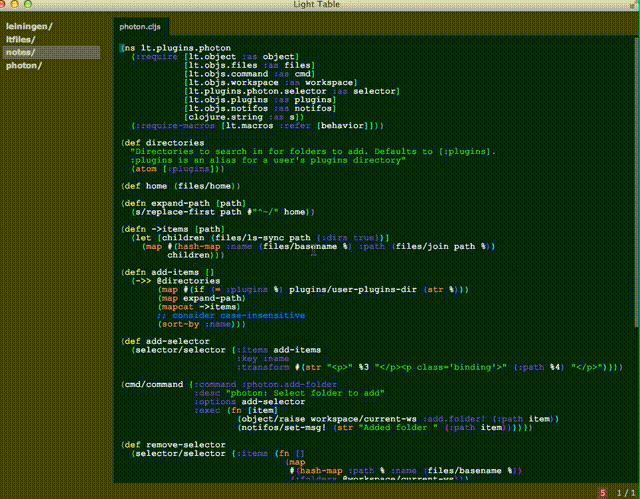

## Description

photon provides a fuzzy finder to open your most active projects. By configuring
it with the parent directories of those projects, almost anything you work on
can be keystrokes away.

## Install

Install this plugin with LT's plugin manager or clone this project to your LT
plugins directory.



## Usage

From the commandbar, choose `photon: Select folder to add`. This activates a
fuzzy finder with possible projects to add to your workspace. To bring up a
project, type the first few letters of a project's name. For example, say you
had these project directories:

```
~/code
├── fork
│   ├── CodeMirror
│   └── LightTable
└── repo
    ├── boson
    └── lightning
```

Typing `C`, `L`, `b` or `l` would be enough to highlight any of these projects.

photon also provides a command to remove a project from your workspace, `photon:
Select folder to remove`.


## Configuration

By default photon only knows where your plugin directories are. The more
directories you tell photon about, the more convenience it will give you. For
example, let's add the parent directories from the Usage example:

```clj
 ;; In user.behaviors
  :app [
    ...
    (:lt.plugins.photon/set-directories
      ;; :plugins is an alias for your plugins directory
      [:plugins "~/code/fork" "~/code/cjars")]
```

Note that this configuration won't change much since we specify parent directories.
As we add new projects under them, photon automatically picks up the new projects.

For another behaviors example, [see my configuration](#TODO).

Like any command, the commands to add and remove projects can be activated with
keybindings. For example:

```
  ;; in user.keymaps
  :app {
    ...
    "alt-a" [:photon.add-folder]}
```

## Bugs/Issues

Please report them [on github](http://github.com/cldwalker/photon/issues).

## Contributions

[See here](http://tagaholic.me/contributing.html) for contributing guidelines.
